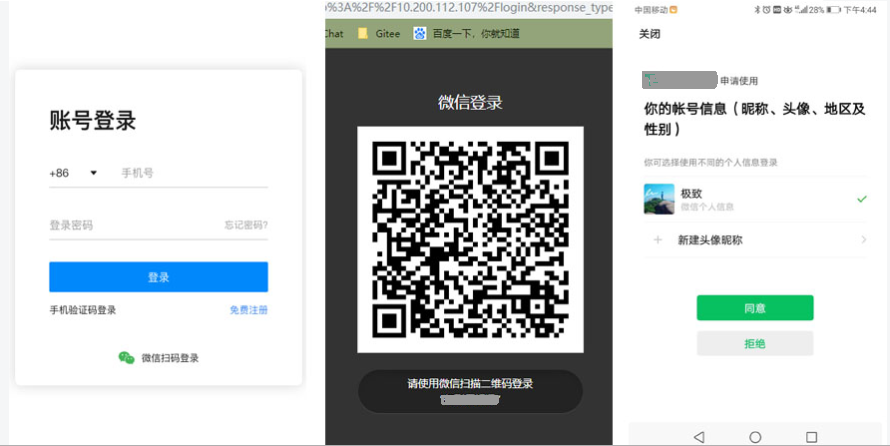
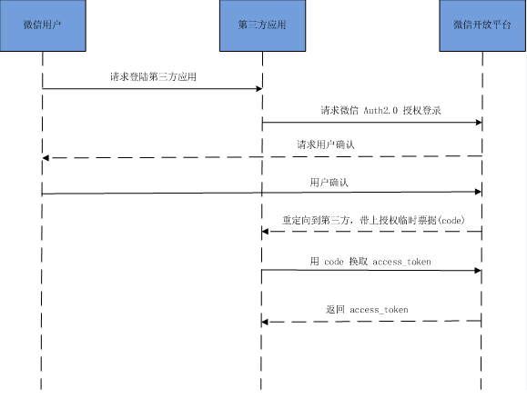
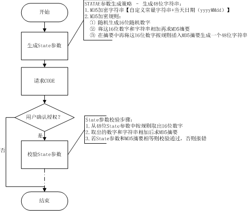

# 基于 Spring Boot 和 WxJava 实现网站接入微信扫码登录

## 1. 概述

项目源码：[基于 Spring Boot 和 WxJava 实现网站接入微信扫码登录](https://github.com/DavidWhom/wechat-login)

如果项目存在什么问题，欢迎大家提 [issue](https://github.com/DavidWhom/wechat-login/issues)，期待你的来访

demo 使用了Spring Boot 和 [WxJava](https://github.com/Wechat-Group/WxJava)(微信开发 Java SDK，支持包括微信支付、开放平台、小程序、企业微信/企业号和公众号等的后端开发)

**WxJava**

> WxJava 是使用 Java 进行微信开发的一款广受好评的 SDK，GitHub star 15K+，文档和 demo 丰富。简单易用，极大地较少了微信开发的工作量和时间成本。感兴趣的同学可到 GitHub 下载其源码进行学习。本 Demo 仅使用到其 ```公众号模块-weixin-java-mp```

**最终实现效果：网站登录 —> 引导到微信授权登录页—> 微信扫码进行授权**

<div align="center">
    
</div>


## 2. 前置工作

网站应用微信登录是基于 ```OAuth2.0``` 协议标准构建的微信```OAuth2.0```授权登录系统。
在进行微信 ```OAuth2.0``` 授权登录接入之前，在[微信开放平台](https://open.weixin.qq.com/cgi-bin/index?t=home/index&lang=zh_CN)注册开发者帐号，并拥有一个已审核通过的网站应用，并获得相应的 ```AppID``` 和 ```AppSecret``` ，申请微信登录且通过审核后，可开始接入流程。


### 2.1 微信开放平台认证流程

+ 进入微信开放平台。
+ 使用帐号登录后进入到帐号中心–》开发者资格认证–》认证（需要年费300RMB，另外认证需要提交公司营业执照一些信息）此处按要求填写即可。认证成功与否一般会在两日内回复结果。此处不再赘述。
+ 认证成功后就可以对我们现有的网站系统进行开发了。资源中心中有官方给的一些参考 demo。可以自行查看。
+ 进入到管理中心–》网站应用–》创建网站应用–》填写基本信息–》填写网站信息。需要说明的是开发信息中有个授权回调域，此处填写的是我们项目所在的域名（此域名可以修改，其他信息修改需要重新审核）。
+ 提交成功后官方会对所申请的网站应用进行审核（我到第七天才审核通过）。审核成功后我们就能看到我们开发所需要的 AppID 和 AppSecret（第一次使用使用需要用绑定的微信号扫码生成）。

### 2.1 项目引入 WxJava

#### pom.xml

```xml
	<properties>
        <!-- more -->
        <!-- WeChat -->
        <weixin-java-mp.version>3.4.0</weixin-java-mp.version>
    </properties>
    <dependencies>
        <!-- more -->
        <!-- WeChatQrCode -->
        <dependency>
            <groupId>com.github.binarywang</groupId>
            <artifactId>weixin-java-mp</artifactId>
            <version>${weixin-java-mp.version}</version>
        </dependency>
    </dependencies>
```

#### application.yml

```yml
wx:
  open:
    config:
      # 填写自己的 appid
      appid: xxxxxxxxxxxxxxxxxxxxxxx
      # 填写自己的 secret
      secret: xxxxxxxxxxxxxxxxxxxxxxxxx
      redirectUrl: http://www.xxx.com/wxCallBack
      csrfKey: WeChat_WxJava_Demo
```

#### Config

```java
@Configuration
@Data
public class WxOpenConfig {
    /**
     * 设置云视讯的appid
     */
    @Value("${wx.open.config.appid}")
    private String appid;

    /**
     * 设置云视讯的app secret
     */
    @Value("${wx.open.config.secret}")
    private String secret;

    @Bean
    public WxMpService wxMpService() {
        WxMpService service = new WxMpServiceImpl();

        WxMpInMemoryConfigStorage configStorage = new WxMpInMemoryConfigStorage();
        configStorage.setAppId(appid);
        configStorage.setSecret(secret);

        service.setWxMpConfigStorage(configStorage);
        return service;
    }
}

```


## 3. 与微信平台交互的步骤以及实现

微信 ```OAuth2.0``` 授权登录让微信用户使用微信身份安全登录第三方应用或网站，在微信用户授权登录已接入微信 ```OAuth2.0``` 的第三方应用后，第三方可以获取到用户的接口调用凭证（```access_token```），通过```access_token``` 可以进行微信开放平台授权关系接口调用，从而可实现获取微信用户基本开放信息和帮助用户实现基础开放功能等。
微信 ```OAuth2.0``` 授权登录目前支持 ```authorization_code``` 模式，适用于拥有 ```server``` 端的应用授权。该模式整体流程为：

> 1. 第三方发起微信授权登录请求，微信用户允许授权第三方应用后，微信会拉起应用或重定向到第三方网站，并且带上授权临时票据 ```code``` 参数；
> 2. 通过code参数加上 ```AppID``` 和 ```AppSecret``` 等，通过 ```API``` 换取 ```access_token```；
> 3. 通过 ```access_token``` 进行接口调用，获取用户基本数据资源或帮助用户实现基本操作。


### 3.1 获取 access_token 时序图

<div align="center">
    
</div>


### 3.2 第一步：请求 CODE

使用网站应用授权登录前必须获取相应网页授权作用域（```scope=snsapi_login```），才可以通过在PC端打开以下链接：
https://open.weixin.qq.com/connect/qrconnect?appid=APPID&redirect_uri=REDIRECT_URI&response_type=code&scope=SCOPE&state=STATE#wechat_redirect
***注意：若提示“该链接无法访问”，请检查参数是否填写错误，如 ```redirect_uri```的域名与审核时填写的授权域名不一致或 ```scope``` 不为 ```snsapi_login```。***

**参数说明**

| 参数          | 是否必须 | 说明                                                         |
| :------------ | :------- | :----------------------------------------------------------- |
| appid         | 是       | 应用唯一标识                                                 |
| redirect_uri  | 是       | 请使用 urlEncode 对链接进行处理                              |
| response_type | 是       | 填 code                                                      |
| scope         | 是       | 应用授权作用域，拥有多个作用域用逗号（,）分隔，网页应用目前仅填写snsapi_login 即可 |
| state         | 否       | 用于保持请求和回调的状态，授权请求后原样带回给第三方。该参数可用于防止 csrf攻击（跨站请求伪造攻击），建议第三方带上该参数，可设置为简单的随机数加session 进行校验 |

**返回说明**

用户允许授权后，将会重定向到 ```redirect_uri``` 的网址上，并且带上 ```code``` 和 ```state``` 参数

```
redirect_uri?code=CODE&state=STATE
```

若用户禁止授权，则重定向后不会带上 ```code``` 参数，仅会带上 ```state``` 参数

```
redirect_uri?state=STATE
```

**防止跨站请求伪造策略**

<div align="center">
    
</div>

#### 3.2.1 代码实现

获取微信二维码页面的地址，这个地址一定要前端发请求给后端。因为 redirectUrl 配置在后端且 state 参数在后端生成。

**Controller**

```java
@RestController
public class WeChatController {

    @Autowired
    private WeChatService weChatService;

    /**
     * 获取微信登陆二维码地址
     * @return
     */
    @GetMapping("/getQRCodeUrl")
    public RestResult getQRCodeUrl() {
        return RestResultGenerator.createOkResult(weChatService.getQRCodeUrl());
    }
    
    // 省略
}
```

**Service**

```java
@Service
@Slf4j
public class WeChatServiceImpl implements WeChatService {

    @Autowired
    private WxMpService wxMpService;

    @Value("${wx.open.config.redirectUrl}")
    private String wxRedirectUrl;

    @Value("${wx.open.config.csrfKey}")
    private String CSRF_KEY;

    @Override
    public String getQRCodeUrl() {
        // 生成 state 参数，用于防止 csrf
        String date = DateUtil.format(new Date(), "yyyyMMdd");
        String state = MD5Utils.generate(CSRF_KEY + date);
        return wxMpService.buildQrConnectUrl(wxRedirectUrl, Constant.WeChatLogin.SCOPE, state);
    }
    
    // 省略
}
```


### 3.3 第二步：通过 code 获取 openid 和 access_token

通过 ```code``` 获取 ```openid```

```
https://api.weixin.qq.com/sns/oauth2/access_token?appid=APPID&secret=SECRET&code=CODE&grant_type=authorization_code
```

**参数说明**

| 参数       | 是否必须 | 说明                                                     |
| :--------- | :------- | :------------------------------------------------------- |
| appid      | 是       | 应用唯一标识，在微信开放平台提交应用审核通过后获得       |
| secret     | 是       | 应用密钥 AppSecret，在微信开放平台提交应用审核通过后获得 |
| code       | 是       | 填写第一步获取的 code 参数                               |
| grant_type | 是       | 填 authorization_code                                    |

**返回说明**

正确的返回：

```json
{ 
    "access_token":"ACCESS_TOKEN", 
    "expires_in":7200, 
    "refresh_token":"REFRESH_TOKEN",
    "openid":"OPENID", 
    "scope":"SCOPE",
    "unionid": "o6_bmasdasdsad6_2sgVt7hMZOPfL"
}
```

**参数说明**

| 参数          | 说明                                                         |
| :------------ | :----------------------------------------------------------- |
| access_token  | 接口调用凭证                                                 |
| expires_in    | access_token 接口调用凭证超时时间，单位（秒）                |
| refresh_token | 用户刷新 access_token                                        |
| openid        | 授权用户唯一标识                                             |
| scope         | 用户授权的作用域，使用逗号（,）分隔                          |
| unionid       | 当且仅当该网站应用已获得该用户的 userinfo 授权时，才会出现该字段。 |

错误返回样例：

```json{
{
    "errcode":40029,
    "errmsg":"invalid code"
}
```

#### 3.3.1 代码实现

**注意：回调地址一定是要在微信开放平台里我们配置的授权回调域下的接口**

**Controller**

```java
/**
     * 微信扫码回调处理
     * 使用 @Valid + BindingResult 进行 controller 参数校验，实现断路器。大家可以根据自己的喜好来，不必一定要跟我这样做
     * @param input
     * @param bindingResult
     * @return
     */
    @GetMapping("/wxCallBack")
    public String wxCallBack(@RequestBody @Valid LoginProtocol.WeChatQrCodeCallBack.Input input, BindingResult bindingResult) {

        if (bindingResult.hasErrors()) {
            return "failedPage";
        }

        if (weChatService.wxCallBack(input)) {
            return "successPage";
        } else {
            return "failedPage";
        }
    }
```

**Service**

```java
@Override
public Boolean wxCallBack(LoginProtocol.WeChatQrCodeCallBack.Input input) {

    String code = input.getCode();
    String state = input.getState();
    String openid = null;
    String token = null;

    if (code == null) {
        return false;
    }

    if (code != null && state != null) {
        // 验证 state,防止跨站请求伪造攻击
        String date = DateUtil.format(new Date(), "yyyyMMdd");
        Boolean isNotCsrf = MD5Utils.verify(CSRF_KEY + date, state);
        if (!isNotCsrf) {
            return false;
        }

        // 获取 openid
        try {

            WxMpOAuth2AccessToken accessToken =wxMpService.oauth2getAccessToken(code);
            openid = accessToken.getOpenId();
            token = accessToken.getAccessToken();


            // 拿到 openid 后做自己的业务, 获取用 token 进一步获取用户信息

            // 用 access_token 获取用户的信息
            WxMpUser user = wxMpService.oauth2getUserInfo(accessToken, null);

        } catch (WxErrorException e) {
            log.error(e.getMessage(), e);
        }

        return true;
    }
    return false;
}
```


**请大家支持原创，转载请注明出处，谢谢。**

**微信：weinixieshi210**

<div align="center">
    
</div>